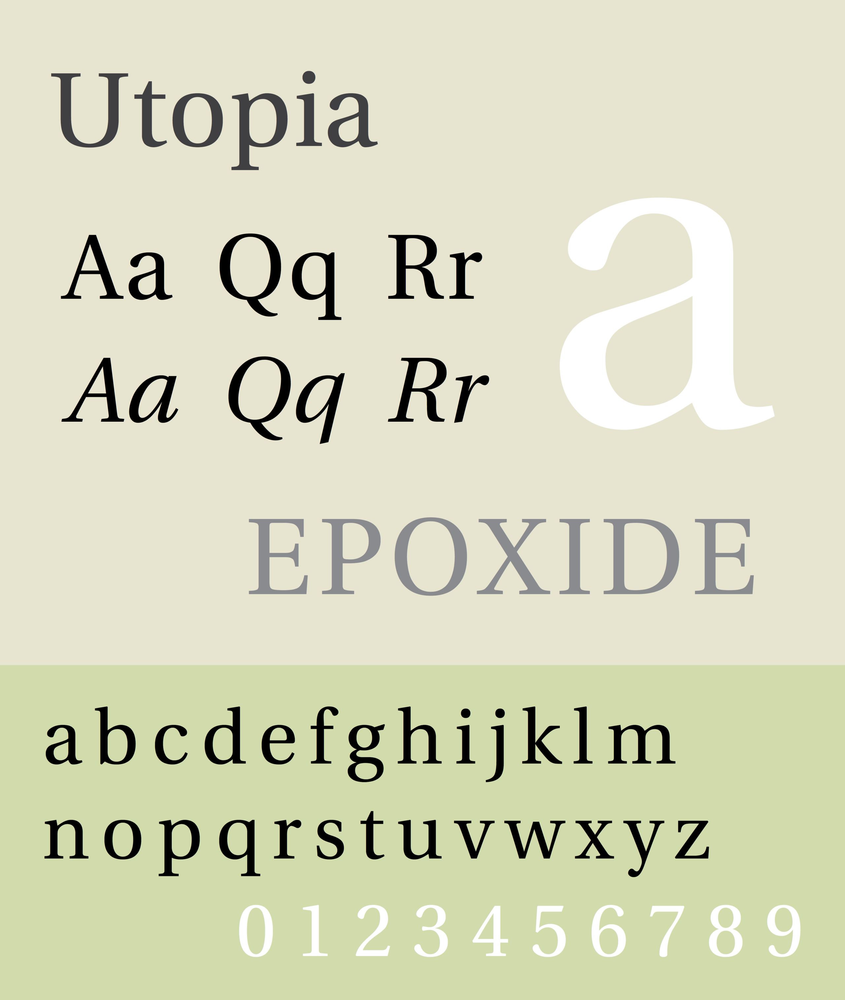

# Utopia



## Introduction

In 1989, Adobe contributed PostScript versions of the basic Utopia family to the X Consortium.
These original files are still available and can be freely downloaded, but they can be hard to find.
So I tracked them down and wrote a script to convert them into a new package of OTFs, TTFs, and webfonts.

## Build

```bash
$ ./build.sh
$ ls dist/*.zip
dist/Utopia.zip
```

## License

See [COPYING](./COPYING).

## Related

- [Luxi fonts](https://github.com/basil/bh-ttf)
- [Bitstream fonts](https://github.com/basil/bitstream-type1)
- [IBM Courier](https://github.com/basil/ibm-type1)
- [URW base 35 fonts](https://github.com/basil/urw-base35-fonts)
- [URW free fonts](https://github.com/basil/urw-free-fonts)

## Original

In the interests of furthering standards for the X Window System, Adobe
Systems Incorporated has contributed to the X Consortium and its members
the Adobe typeface software listed below. This Adobe Type 1 font software
donation will now allow users to experience and freely use traditional
high-quality Adobe type in the X Window environment.

Permission to use, reproduce, display and distribute the listed typefaces
is hereby granted, provided that the Adobe Copyright notice appears in all
whole and partial copies of the software and that the following trademark
symbol and attribution appear in all unmodified copies of the software:

        Copyright (c) 1989 Adobe Systems Incorporated
        Utopia (R)
        Utopia is a registered trademark of Adobe Systems Incorporated

The Adobe typefaces (Type 1 font program, bitmaps and Adobe Font Metric
files) donated are:

        Utopia Regular
        Utopia Italic
        Utopia Bold
        Utopia Bold Italic


Adobe Systems Incorporated

All questions regarding this software should be directed at the
Xorg mailing list:

  https://lists.x.org/mailman/listinfo/xorg

The primary development code repository can be found at:

  https://gitlab.freedesktop.org/xorg/font/adobe-utopia-type1

Please submit bug reports and requests to merge patches there.

For patch submission instructions, see:

  https://www.x.org/wiki/Development/Documentation/SubmittingPatches

